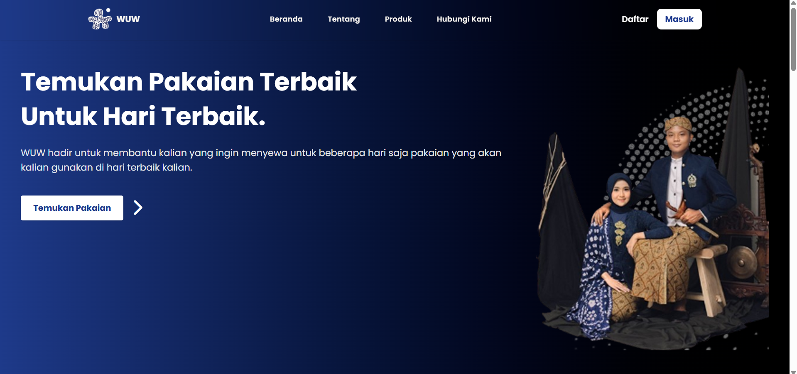

<h1 align="center">
  
  WUW - WearYouWant
</h1>

<p align="center">
  <!-- You can replace this image with your own logo -->
  
</p>

<p align="center">A web-based application for wedding and graduation outfit rentals.</p>


---

## 👥 Development Team

| Name                      | NIM     |
|---------------------------|----------------|
| Leo Afif Eka Permana           | 3312401041     |
| Muhammad Faiq   | 3312401031     |
| Ananda Khusnul Hotimah  | 3312401044     |
| Muhammad Deza Awdino   | 3312401050     |

## 📦 About the Project

**WUW - WearYouWant** is a web-based application that makes it easy for users to rent outfits for wedding and graduation events. With a user-friendly interface and a seamless payment process, WUW aims to be a modern digital solution for formal wear rentals.

---

## 🛠️ Tech Stack

We used modern and reliable technologies to build this application:

- **Backend:** Laravel 12, MySQL  
- **Frontend:** Tailwind CSS,  Blade  
- **Full-stack Tooling:** Livewire  
- **Admin Panel:** Filament  
- **Payment Gateway:** Midtrans  

---

## 🚀 Getting Started

### ✅ Prerequisites

Make sure you have the following installed:

- PHP 8.3+
- Composer
- Node.js & NPM
- MySQL

### 💻 Installation (Step-by-Step)

1. **Clone the repository and navigate to the project directory**
    ```bash
    git clone https://github.com/your-username/your-repository-name.git
    cd your-repository-name
    ```

2. **Install backend and frontend dependencies**
    ```bash
    composer install
    npm install
    ```

3. **Copy and configure the environment file**
    ```bash
    cp .env.example .env
    # Edit the .env file:
    # - DB_DATABASE=your_database
    # - DB_USERNAME=your_username
    # - DB_PASSWORD=your_password
    # - MIDTRANS_SERVER_KEY=your_midtrans_server_key
    # - MIDTRANS_CLIENT_KEY=your_midtrans_client_key
    ```

4. **Generate application key and migrate the database**
    ```bash
    php artisan key:generate
    php artisan migrate --seed
    ```

5. **Build frontend assets and run the development server**
    ```bash
    npm run dev
    php artisan serve
    ```

🔗 Access the application via your browser: [http://127.0.0.1:8000](http://127.0.0.1:8000)

---

